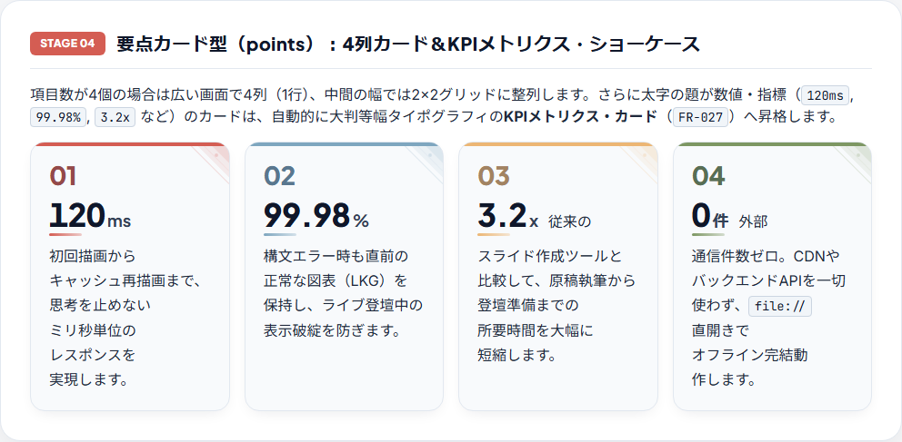
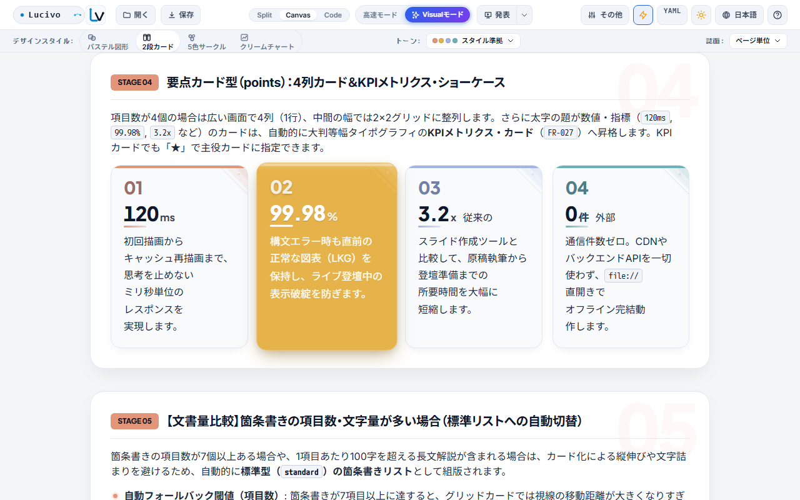
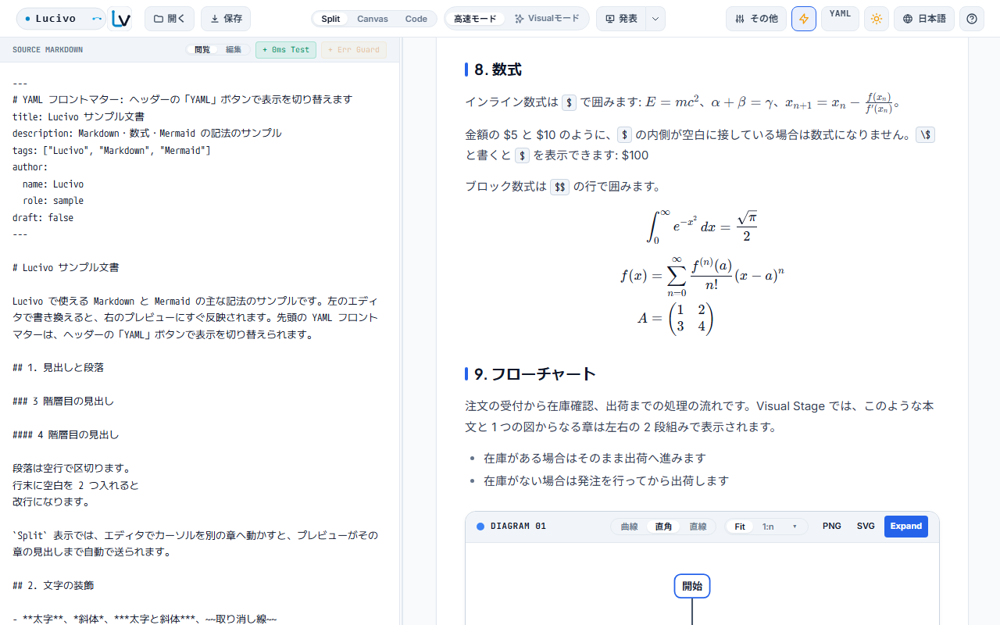
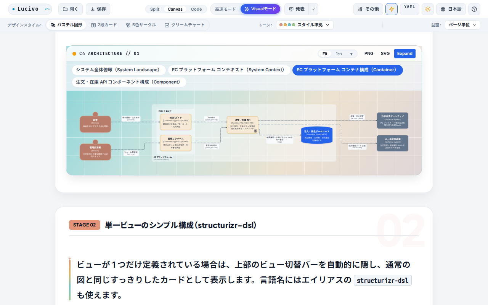
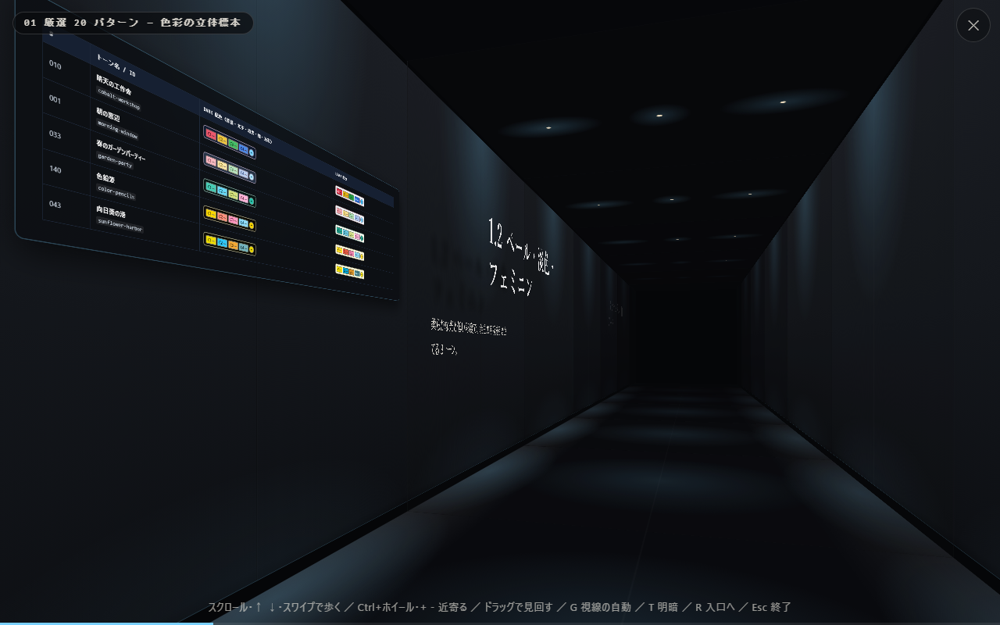

<p align="center">
  <picture>
    <source media="(prefers-color-scheme: dark)" srcset="public/assets/logos/dark/logo_full.svg">
    
  </picture>
</p>

# Lucivo Markdown Presenter — Exhibition-Grade Markdown Viewer —

- **Version**: `0.18.0`
- **Language**: 日本語 | [English](README.en.md)

Lucivo（ルシーヴォ）は、Markdown 文書・Mermaid ダイアグラム・Structurizr DSL による C4 モデル図をブラウザ単体で表示するビューアーです。ローカルの Markdown ファイルをそのまま開くだけで、「読むための軽快な仕様書」と「見せるための展示・講演品質」の 2 つの表示モードを瞬時に切り替えられます。

<p align="center">
  <a href="https://prankster-freedom.github.io/Lucivo/ja/"><strong>Web 版を開く</strong></a>
  &nbsp;·&nbsp;
  <a href="https://github.com/prankster-freedom/Lucivo/releases/latest"><strong>ダウンロード版（ZIP）</strong></a>
  &nbsp;·&nbsp;
  <a href="https://prankster-freedom.github.io/Lucivo/preview/"><strong>プレビュー版</strong></a>
</p>

<p align="center">
  
  
</p>

| モード       | こんなときに               | 特長 |
| :----------- | :------------------------- | :--- |
| 高速モード   | 仕様書・設計書を読む・書く | 余計な装飾を排した仕様書スタイル。起動から閲覧・入力まで待たされない軽快さを最優先 |
| Visualモード | 講演・展示会・レビューで見せる | 4 種のインフォグラフィックスタイルで、文書と図をそのまま講演資料・展示素材の品質に組版 |

## 特長

- **読む軽快さと見せる品質を 1 本で両立**: 日常の仕様確認に使う「高速モード」と、そのまま人に見せられる「Visualモード」を、同じ文書からワンクリックで切り替えられます。
- **Models as code に基づく C4 モデル図の多ビュー描画（Web 版）**: C4 モデルの考案者 Simon Brown 氏が策定した Structurizr DSL に対応。1 つのモデル（Workspace）から System Landscape / System Context / Container / Component の各ビューを切り替え、要素のクリックで下位ビューへ掘り下げたり、ステージ発表中にビューを切り替えたりできます。
- **スライド作り直し不要の「ステージ発表」**: 独自記法は一切不要です。標準の Markdown と Mermaid のまま、1 章 1 シーンの全画面プレゼンテーション（自動進行・俯瞰一覧・光のポインター）が行えます。
- **Web 版とスタンドアロン版（オフライン版）の 2 提供形態**: 最新機能を網羅した Web 版と、インターネットに一切接続せず `file://` 直開きで安全に使えるスタンドアロン版（ZIP）を用意しています。

## はじめかた

利用スタイルに合わせて、次から選んで始められます。

| 提供形態                         | こんなときに                 | リンク |
| :------------------------------- | :--------------------------- | :----- |
| 正式リリース版（Web 版）         | インストール不要ですぐ使う   | [prankster-freedom.github.io/Lucivo/ja](https://prankster-freedom.github.io/Lucivo/ja/) |
| 正式リリース版（ダウンロード版） | オフラインで安全に使う       | [GitHub Releases の最新版](https://github.com/prankster-freedom/Lucivo/releases/latest) |
| プレビュー版（Web 版）           | リリース前の次の版を先に試す | [prankster-freedom.github.io/Lucivo/preview](https://prankster-freedom.github.io/Lucivo/preview/) |

- **Web 版**: 正式リリース版（Web 版）のリンクをブラウザで開きます。インストール不要でそのまま使えます。
- **スタンドアロン版（ZIP）**: GitHub Releases の最新版から `Lucivo-v<版>.zip` をダウンロードして展開し、フォルダ内の `index.html` をブラウザで開きます。
- **プレビュー版**: リリース前の変更を反映した Web 版です。画面の版の表記は `X.Y.Z-canary (build id: <run_id>)` になります。

> [!NOTE]
> プレビュー版は動作が不安定なことがあるため、普段の利用には正式リリース版をお使いください。

> [!TIP]
> 動作確認は Chromium 系ブラウザ（Google Chrome / Microsoft Edge）を推奨しています。

### 提供形態別の機能差

| 機能                                               | Web 版 | スタンドアロン版（ZIP） |
| :------------------------------------------------- | :----: | :---------------------: |
| 高速モード・Visualモード                           | ○      | ○                       |
| スタイル別見出し書体（丸ゴシック・明朝）           | ○      | —（共通書体で表示）     |
| Structurizr DSL による C4 モデル図の描画           | ○      | —（コード表示＋案内）   |
| ステージ発表（全画面・自動進行・俯瞰・ポインター） | ○      | ○                       |
| ミュージアム・ウォーク（「発表」▾ から起動）       | ○      | —                       |

### 操作手順

1. **文書を開く**:
   - **ファイルを開く**: Markdown ファイル（`.md` / `.markdown` / `.txt`）をウィンドウへ直接ドラッグ&ドロップします。文字コード（UTF-8・Shift_JIS・EUC-JP など）と改行コードは自動判別されます。
   - **フォルダごと開く**: フォルダをウィンドウへドラッグ&ドロップすると、左ペインの一覧からファイルを選べます。相対パス画像（`images/a.png`）の表示や、Markdown 間リンク（`[概要](overview.md)`）のページ内遷移にも対応します（サイドバーは `«` で格納できます）。
   - **公開 URL から開く・見た目を URL で共有する**: 公開 URL をウィンドウへドラッグ&ドロップするか、`?url=<公開URL>` を指定して Web 上の Markdown を直接開けます。GitHub の `blob` URL（単一ファイル・相対画像/リンク解決）や `tree` URL（フォルダ一覧表示）にも対応し、表示状態（`mode` / `theme` / `style` / `tone` / `view` / `layout` / `lang`）もアドレスバーの URL パラメータで共有・ブックマークできます。
   - **外部更新の自動反映**: Chrome / Edge 等の対応ブラウザで開いたローカルファイルが外部エディタで更新されたとき、未編集ならスクロール位置を保って自動反映します。編集中は上書きせず、通知バーから再読み込みできます（設定でオフにできます）。
2. **モードを切り替える**: ヘッダー中央の「高速モード」「Visualモード」ボタンを押すだけで、表示スタイルが即座に切り替わります。

### サンプル

Web 版は GitHub 上のサンプルを直接読み込み、ダウンロード版（ZIP）は同じサンプルを同梱しています。

<p align="center">
  
  
  
  
</p>

| サンプル                                                              | 内容 |
| :-------------------------------------------------------------------- | :--- |
| [visual-sample.md](public/samples/visual-sample.md)                   | Visualモードの表紙・各種誌面雛形・表・光の流動演出・ステージ発表 |
| [notation_sample.md](public/samples/notation_sample.md)               | Markdown と Mermaid の記法一覧（全図種・数式・コールアウト・脚注・絵文字など） |
| [notation_sample_extra1.md](public/samples/notation_sample_extra1.md) | 発展的記法（CommonMark・GFM）、画像・文書間リンク、フォルダ構成ツリー、数式補足グラフ |
| [sample-Structurizr.md](public/samples/sample-Structurizr.md)         | Structurizr DSL による C4 モデル図（多ビュー切替・階層ズームイン・公式チュートリアル／未対応構文スキップ例。Web 版のみ描画） |
| [color-museum-sample.md](public/samples/color-museum-sample.md)       | 配色ミュージアム（ポスター・窓・風景・色面・図で、色が人の心を動かす瞬間を巡る展示。Dark ミュージアム・ウォーク向け） |

## できること

### 閲覧と編集

- **画面分割の切り替え**: ヘッダー中央の `Split`（エディタとプレビューの左右分割）/ `Canvas`（プレビュー単独）/ `Code`（エディタ単独）で表示を切り替えます。
- **安全な閲覧・編集モード**: 文書読み込み直後は誤編集を防ぐ読み取り専用（`閲覧`）です。エディタ上部の `閲覧` | `編集` で切り替えます。編集内容はリアルタイムにプレビューへ反映され、`Split` 表示中はエディタのカーソル位置にプレビューが追従します。
- **ダウンロード保存**: ヘッダーの「保存」から、編集済み文書を Markdown ファイルとしてダウンロードします（元ファイルは上書きされません）。未保存の変更がある状態で別の文書を開く際は、確認ダイアログが表示されます。
- **読み込み時の自動整形**: 開いた文書の表示内容を変えずに、Markdown の構文（見出し `#` 後の空白、ブロック前後の空行、リスト記号、表の列揃え）を整然と自動整形して表示します（パレット設定で無効化できます）。
- **テーマとカラートーン**: ヘッダー右上の太陽 / 月アイコンで Light / Dark を切り替えられます。設定モーダルからは、お好みのカラートーンを選択できます。

### 書ける内容（Markdown & ダイアグラム）

- **標準 Markdown / GFM**: 見出し・表・リスト・コードブロック・引用に加え、タスクリスト、**GFM 脚注（`[^1]`）**、**絵文字ショートコード（`:rocket:` など）** に対応しています。
- **多彩な Mermaid 図表**: ```` ```mermaid ```` で記述したフローチャート、シーケンス図、状態遷移図、クラス図、ガントチャート、マインドマップ、タイムライン、円グラフ、ユーザージャーニー、4 象限チャートなどを高品位にレンダリングします。
- **Structurizr DSL による C4 モデル図（Web 版）**: C4 モデルの考案者 Simon Brown 氏が "models as code" のために策定した [Structurizr DSL](https://docs.structurizr.com/)（```` ```structurizr ```` / ```` ```structurizr-dsl ````）をサーバー通信なしで解析・描画します。1 つの Workspace から System Landscape・System Context・Container・Component の各ビュー（Code 図は対象外）を切り替え、下位要素の関係から上位ビューの関係を導出する Implied relationships、要素からのズームイン（階層ドリルダウン）とパンくず戻り、ステージ発表中の `[` / `]` ビュー切替、印刷時の全ビュー出力に対応します（`deploymentEnvironment`・`dynamic`・`filtered`・外部 `theme` などの未対応構文は安全にスキップし、警告バッジで一覧表示します）。
- **TeX 数式**: インライン `$…$` とブロック `$$…$$` の KaTeX 数式に対応しています。フローチャートやシーケンス図のラベル内数式も描画できます。
- **数式の補足グラフ（数式プロット）**: 本文中の $y = f(x)$ 形式の陽関数から、数式の横へプロット計算した補足グラフ（PNG ラスター画像）を自動生成して並記します。複数式の重ね描きや定義域の明示指定にも対応します。
- **GitHub 準拠のコールアウト**: `> [!NOTE]`、`[!TIP]`、`[!IMPORTANT]`、`[!WARNING]`、`[!CAUTION]` を記述すると、種別に応じた専用アイコンと配色のアラートボックスとして表示されます。
- **YAML フロントマター**: 文書先頭の `---` で囲んだメタデータ（`title`、`description`、`tags`、`author`、`date` など）は、Visualモードの表紙スペックバッジやタイトルへ美しく組み込まれます。

### 図の操作・倍率制御

各図表カードの右上ツールバーから、自在な操作が行えます。

- **4 段階の表示倍率**: `Fit`（縦横枠内収容）/ `1:n`（横幅優先収容）のほか、メニュー（`▾`）から `n:1`（縦幅優先収容）や `100%`（等倍表示）を選択できます。拡大モーダル（`Expand`）内でも同一の倍率切替が可能です。
- **高品位エクスポート**: ワンクリックで高解像度 `PNG` またはベクター `SVG` をダウンロードできます。
- **結線（矢印）の形状変更**: フローチャート・状態遷移図・クラス図では、図ごとに曲線 / 直角 / 直線スタイルを切り替えられます。

> [!NOTE]
> 文字の判読性を保つため、極端に縮小される大規模図面では、自動で横スクロール表示へ切り替わります。

### Visualモード

Visualモードでは、上部のスタイルバーから 4 種類のデザインテーマ（`🎨 パステル図形` / `📋 2段カード` / `⭕ 5色サークル` / `📖 クリームチャート`）を選択できます。

- **表紙とインタラクティブ目次**: フロントマターの情報を活かした展示会仕様の表紙が自動生成されます。章数が 3〜15 の文書には目次スラブが自動挿入され、クリックで目的の章へジャンプできます。
- **文章構造に合わせた誌面雛形への自動昇格**: 各章（`h2`）の記述特性を解析し、最適な雛形レイアウトへ自動変換します。
  - **リード型**: 短文の章を、大きな見出し文字とグラデーション帯による導入スライドへ昇格します。
  - **要点カード型**: 箇条書きをグリッドカード化します。数値見出しは **KPI メトリクス・カード**、日付見出しは **ロードマップ**、Before/After は **比較カード** へ自動変換します。
  - **解説＋図版型**: 短い解説リード文と図表を、上下中央揃えの端正な 2 段組みレイアウトで調和させます。
  - **手順型**: 短い番号付きリストを、接続線上を光が走る横並びステップフローへ昇格します。
  - **用語集**: `**用語** — 説明` の形式を、スタイリッシュな定義カードグリッドへ組版します。
  - **ステートメント**: 短い引用を、洗練された中央揃えのメッセージ枠へレイアウトします。
- **誌面の表とコードブロック**: 表は数値列の右揃え・等幅数字（`tabular-nums`）を適用した誌面テーブルに、コードブロックは言語ラベルとワンクリックコピーボタン付きのコンソール枠に昇華されます。
- **ルミナス・フロー演出 & スポットライト**: フローチャートやシーケンス図の結線を光の粒子が巡り、要点カードや手順ステップをクリックすると周囲を減光して対象を際立たせるスポットライト演出が行えます。

### ステージ発表（プレゼンテーション）

ヘッダーの「発表」ボタン（または `P` キー）を押すと、文書が 1 章 1 シーンのフルスクリーンプレゼンテーションへ移行します。スライド作成ツールへの原稿の移し替えは一切不要です。

- **シーケンシャル表示**: 要点カードや手順ステップを、話の展開に合わせて 1 項目ずつ順に表示できます。
- **充実の登壇サポート**:
  - `A`: 無人展示ブース向けの自動進行ループ
  - `O`: 全シーンを縮小して鳥瞰できる俯瞰ナビゲーション（選択して `Enter` で即座にジャンプ）
  - `L`: 聴衆の視線を引きつける光のポインター（マウス位置に追従するスポットライト）
  - `B` / `Q`: 質疑応答や休憩時に便利な幕間スタンバイカーテン
  - `T`: プレゼンテーション中の Light / Dark 外観切替
- **Web 版限定の次世代発表体験**:
  - **ミュージアム・ウォーク**: 立体回廊の展示室をウォークスルーしながら文書を体験する 3D プレゼンテーションです（`Ctrl`＋ホイールや `+` / `-` / `0` で、展示に一歩近寄って閲覧できます）。

### 印刷・PDF 出力

「保存」→「印刷 / PDF として保存…」（または `Ctrl+P` / `Cmd+P`）から、配布用資料をクリーンに出力できます。画面上のボタン等の UI は自動的に除外されます。

- **Visualモード**: A4 横（16:10 版面）に最適化され、表紙および各章が 1 ページずつ上下中央揃えで端正に収まります。
- **高速モード**: A4 縦の仕様書フォーマットとして、長文ドキュメントを連続出力します。
- **美観を保つ改ページ制御**: 見出し直後で本文が途切れる未亡人行（孤立見出し）を防ぎ、適切な位置で後続ページへ送ります。

### キーボードショートカット一覧

#### 通常閲覧時

| キー                   | 動作                                                                                 |
| :--------------------- | :----------------------------------------------------------------------------------- |
| `J` / `K`（`]` / `[`） | 次 / 前の章へスクロール移動                                                          |
| `M`                    | 高速モードと Visualモードの相互切替                                                  |
| `1`〜`4`               | Visualモードのスタイル切替（1: パステル, 2: 2段カード, 3: 5色サークル, 4: クリーム） |
| `P`                    | ステージ発表（プレゼンテーション）を開始                                             |
| `?`                    | ショートカットキー一覧を表示                                                         |

> [!NOTE]
> テキストエディタなどの入力欄にフォーカスがある間は、ショートカットは作動しません。

#### ステージ発表時

| キー                     | 動作                                                      |
| :----------------------- | :-------------------------------------------------------- |
| `→` / `Space` / クリック | 次のシーン・項目へ進む                                    |
| `←`                      | 前のシーン・項目へ戻る                                    |
| `Home` / `End`           | 最初のシーン / 最後のシーンへジャンプ                     |
| `A`                      | 自動進行ループの開始 / 停止（展示会向け）                 |
| `O`                      | 全シーンの俯瞰一覧表示（矢印キーで選択し `Enter` で移動） |
| `L`                      | 光のポインター（マウス追従スポットライト）のオン / オフ   |
| `B` / `Q`                | 幕間スタンバイ画面の表示 / 解除（質疑応答・休憩用）       |
| `T`                      | 発表画面の Light / Dark テーマ切替                        |
| `Esc`                    | 発表終了（俯瞰や幕間を開いているときはそれらを閉じる）    |

## 安全性とプライバシー

- **フロントエンド完結処理**: 読み込んだファイルはすべてブラウザ内だけで解析・処理されます。外部サーバーへのファイル送信は一切行いません。
- **DOMPurify によるサニタイズ**: Markdown から生成された HTML は DOMPurify で厳格に無害化され、安全に描画されます。
- **セキュアな Mermaid 描画**: Mermaid の `securityLevel: strict` 設定を適用し、ダイアグラム内の悪意あるスクリプト実行を遮断します。
- **ローカル画像の安全な参照**: 本文中の `file://` URL や Windows ローカルパス（`C:\…`）の画像表示に対応しつつ、リンクのローカルプロトコルは無害化して保護します。
- **利用状況の計測（Web 版のみ）**: Web 版では、どのデザインスタイル・カラー トーン・発表モードがよく使われているかを把握するため、Google Analytics（Google Tag Manager 経由）を利用しています。計測対象は選択されたスタイル・トーン・発表モードの種類と配布種別（正式版 / プレビュー版）のみで、ファイル名や文書内容などは送信しません。スタンドアロン版（ZIP 版）には計測コードを含みません。

## 既知の制約

- **ローカル単一ファイル読み込み時の画像相対パス**: ローカルの単一 Markdown ファイルをドラッグ&ドロップで開いた場合、ブラウザのセキュリティ制限により相対パス（`images/a.png`）を解決できません。相対パス画像を含むローカル文書はフォルダごとドラッグ&ドロップして開いてください（公開 URL から開いた文書は、取得元 URL 基準で解決されます）。
- **フォルダアクセスの再確認**: Chrome / Edge では開いたフォルダを記憶しますが、ブラウザの保護ポリシーにより、次回起動時にアクセス許可の再確認が表示されます。
- **ローカルファイルの外部更新自動反映の対応ブラウザ**: 外部更新の自動反映は、File System Access API（`showOpenFilePicker` / `showDirectoryPicker` 等）を利用できるブラウザ（Chrome / Edge 等）で動作します。非対応ブラウザでは、従来どおり手動で開き直してください。

## 開発者向け情報

### ドキュメント体系

新機能の追加や仕様確認は、[プロダクトコンセプト](doc/1.SRS.md#11-プロダクトコンセプト)（高速モードは軽快さ、Visualモードは展示・講演品質を優先）に基づいて行います。

| 知りたいこと                               | ドキュメント                                              |
| :----------------------------------------- | :-------------------------------------------------------- |
| プロダクトコンセプト・要求仕様（FR / NFR） | [doc/1.SRS.md](doc/1.SRS.md)                              |
| 全体アーキテクチャ・主要な設計判断         | [doc/2.ARCHITECTURE.md](doc/2.ARCHITECTURE.md)            |
| 機能詳細設計ノート（Design Notes）         | [doc/3.sw_design_notes/](doc/3.sw_design_notes/README.md) |
| 実装依存関係と改修時の注意事項             | [doc/3.implementation/](doc/3.implementation/README.md)   |
| テスト仕様・検証手順（TC）                 | [doc/4.test_spec/](doc/4.test_spec/README.md)             |
| 変更要求の管理（CR）                       | [doc/6.change_request/](doc/6.change_request/README.md)   |
| Visualモードのデザイン仕様・素材ストック   | [doc/0.DTP/](doc/0.DTP/README.md)                         |

## ライセンス

[MIT License](LICENSE)。同梱ライブラリおよびフォントのライセンスは [public/THIRD_PARTY_LICENSES.txt](public/THIRD_PARTY_LICENSES.txt) をご参照ください。

## リリースノート

直近の 2 版を載せています。過去のすべての版は [release-notes.md](release-notes.md) をご覧ください。

### 0.18.0（2026-11-28）

- feat(stage): ステージ発表中にカーソル位置を円形で拡大表示できる「拡大鏡」を追加しました。境界に向かって倍率が滑らかに 1 倍へつながり、直径（20% / 30% / 40%）と拡大率（1.3x / 2.0x / 2.7x）のプリセットも選べます
- feat(ui): アプリ内のロゴやヘルプボタンから公開 README を開く際に、シングルページ表示（`layout=single`）と Spring Mist トーン（`tone=spring-mist`）で開くようにしました
- fix(editor): エディターとプレビューの同期スクロールにおいて、フォント設定を個別に反映して行位置の計測精度を改善しました

### 0.17.0（2026-11-28）

- feat(visual): ページ単位表示・ステージ発表・印刷の版面を 16:10（縦向きの 10:16 も選択・URL 指定可）にそろえ、収まらない章は自動で文字詰めやページ分割を行い、スマホの横向きなど縦の短い画面でもページ全体が収まるようにしました
- feat(diagram): Web 版で Structurizr DSL による C4 モデル図の描画と多ビュー切り替え（掘り下げ・ステージ発表中のビュー切り替え含む）に対応し、サンプルを追加しました
- feat(i18n): Web 版の公開ページを日本語（`/ja/`）と英語（`/en/`）の言語別ディレクトリに分け、説明文・OGP と切り替え先の言語による表示を整えました
- feat(diagram): 図の Fit 表示で文字の大きさの下限をなくし、大きな図でも常に全体が一画面に収まるようにしました
- feat(museum-walk): スマートフォンの 2 本指ピンチ操作でのズームに対応し、スロープ通過時に足元へ向けて戻るカメラ演出を加えました
- feat(ui): スマートフォン用の「開く」メニューに「配色ミュージアム」と「印刷・PDF の確認」サンプルを追加しました
- fix(museum-walk): スマートフォンでのスワイプによる見回し量を広げ、歩行速度を調整しました
